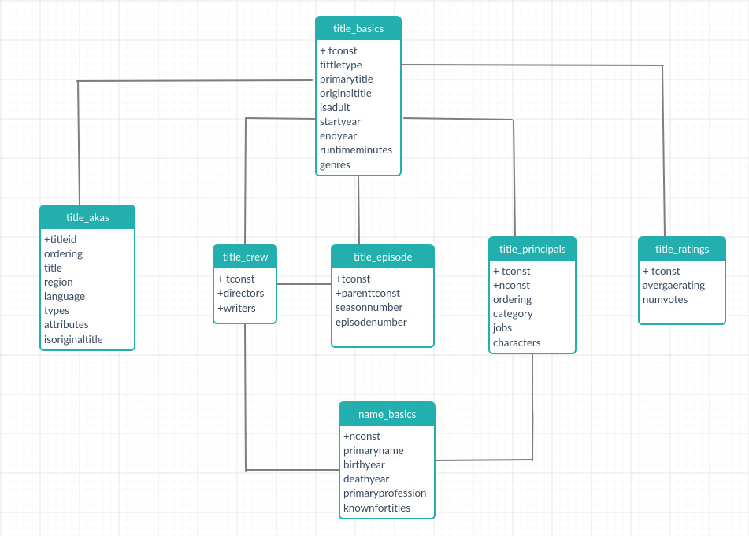

# Tarea - Programación para Ciencia de Datos


**Profesor:** Adolfo de Unanúe Tiscareño

 **Fecha:** 12 de diciembre de 2019

**Integrantes del equipo**

| # | Nombre | Clave |
|---|----------------------------|--------|
| 1 | Laura Gómez Bustamante | 191294 |
| 2 | Miguel Ángel Millán Dorado | 191401 |
| 3 | César Zamora Martínez | 190609 |
| 4 | Marco Julio Monroy Ayala | 187825 |

***

### 0. Introducción

El presente documento expone las consideraciones realizadas para el proyecto final del Seminario de Programación sobre la Internet Movie Database (IMDB), considerando las instrucciones que permiten la creación de una base de datos asociada a ésta, su limpieza y conformación de un esquema semantic a través de PostgreSQL (Postgres).

Para consolidar el material desarrollado se creó un repositorio de Github (disponible a través de la dirección electrónica https://github.com/lauragmz/lauragmz-programming-for-data-science-2019-imdb) que sigue la estructura de carpetas sugerida en el curso para el desarrollo de un proyecto.

En este sentido, debe entenderse que los diferentes archivos y programas desarrollados (en Bash, Python y Postgres) se encuentran dentro de este directorio de trabajo, con lo cual, para seguir el desarrollo realizado para este proyecto se debe clonar el repositorio en comento para ejecutar el código implementado, lo cual se realiza con la siguiente instrucción:
```
git clone https://github.com/lauragmz/lauragmz-programming-for-data-science-2019-imdb
```

Es así que a continuación se expondrá el enfoque seguido para el desarrollo del proyecto en comento.

### 1. Descripción de la fuente de datos

IMDB contiene información relacionada con diferentes medios de entretenimiento visual, tales como películas, programas de televisión y video juegos; incluyendo casting, equipo de producción, biografías personales; así como información sobre los raitings (véase https://www.imdb.com/interfaces/#plain).

De acuerdo a la documentación, dicha base se integra por siete conjuntos de datos denominados i) title_basics, ii) title_akas, iii) title_crew, iv) title_episode, v) title_principals, vi) title_ratings y vii) name_basics; los cuales se actualizan de manera diaria y que se encuentran disponibles para su descarga en la dirección electrónica https://datasets.imdbws.com/.

A continuación se ofrece un resumen del contenido de tales conjuntos de datos:

* **title_basics:** describe características especiales de los títulos de las películas; tales como el tipo del título, el título más popular, el título original, la clasificación adulto o no, los años de inicio  y fin (en caso de las series de televisión), la duración y el género.

* **title_akas:** relativa  al título adaptado de las películas a través de la región para esta versión del título, el idioma y los atributos asociados. Además indica si el título es original o no.

* **title_crew:** contiene los nombres del director y los escritores de los títulos de IMDB.

* **title_episode:** incluye información de los episodios de series de tv, considerando la temporada a la que pertenece el episodio así como el número de episodio.

* **title_principals:** describe los principales miembros del equipo de producción de las películas,considerando un identificador de la persona, la categoría del trabajo de la persona, el trabajo específico y el nombre del personaje.

* **title_ratings:** referente a los raitings y votos de las películas,a través  del peso promedio de todos los individuos que usan raitings; así como el número de votos que el título ha recibido.

* **name_basics:** contiene la información principal de actores, directores, escritores y demás involucrados en los títulos, en términos del nombre por el cual la persona es "most often credited", año de nacimiento, año de muerte, el top-3 de las profesiones de las personas y títulos por los cuáles la persona es conocida.


### 2. Descripción de la entidad


[Pendiente: Describir entidades y eventos]

Un punto que puede ser relevante para estudio, es con base en [...] realizar predicciones del éxito obtenido por

### 3. Estructura de la base de datos

De acuerdo a la información proporcionada para IMDB (ver https://www.imdb.com/interfaces/#plain), así como derivado del análisis de los conjuntos de datos de ésta, se tiene que la información en cuestión se puede describir como:


**Cuadro 1:** Tabla describiendo las columnas de la relación *title_akas*, [Pendiente: decidir si nombramos por tabla y archivo]

| elemento   | descripción                                            | observación                                                                     |
|------------|--------------------------------------------------------|---------------------------------------------------------------------------------|
| titleid      | identificador del títutlo                              |                                                                                 |
| ordering   | identificador de las filas de un título                |                                                                                 |
| title  | nombre adaptado del ttulo                              |                                                                                 |
| region     | region de la versión del título adaptado               |                                                                                 |
| language   | idioma del título adaptado                             |                                                                                 |
| types      | conjunto de atributos del títutlo adaptado             | posibles valores "alternative", "dvd", "festival", "tv", "video", "working",etc |
| atributes  | terminos adicioanles para describir el título adaptado |                                                                                 |
| isoriginaltitle | indica si el título adaptado corresponde al original   | posibles valores "0 : not original title", "1: original title"                  |


**Cuadro 2:** Tabla describiendo las columnas de la relación *title_basics*, [Pendiente: decidir si nombramos por tabla y archivo]

| **elemento**   | **descripción**                | **observación**                                                         |
|----------------|--------------------------------|-------------------------------------------------------------------------|
| tconst          | identificador del títutlo      |                                                                         |
| titletype      | tipo o formato del título      | posibles valores "movie", "short", "tvseries", "tvepisode", "video",etc |
| primarytitle   | nombre más popular del título  |                                                                         |
| originaltitle  | títutlo en el idioma original  |                                                                         |
| isadult        | clasificador del título        | posibles valores "0: no adulto", "1: adulto"                            |
| startyear      | año de realización del título  | en el caso de "tvseries" corresponde al año de inicio                   |
| endyear        | año de termino de "tvseries"   |                                                                         |
| runtimeminutes | duración en minutos del título |                                                                         |
| genres         | género del título              | incluye hasta tres géneros                                              |


**Cuadro 3:** Tabla describiendo las columnas de la relación *title_crew*, [Pendiente: decidir si nombramos por tabla y archivo]

| **elemento** | **descripción**            | **observación** |
|--------------|----------------------------|-----------------|
| tconst        | identificador del título   |                 |
| directors    | identificador del director |                 |
| writers   | identificador del escritor |                 |


**Cuadro 4:** Tabla describiendo las columnas de la relación *title_episode*, [Pendiente: decidir si nombramos por tabla y archivo]


| **elemento**  | **descripción**                                    | **observación** |
|---------------|----------------------------------------------------|-----------------|
| tconst         | identificador del título                           |                 |
| parenttconst        | identificador del padre de las "tvseries"          |                 |
| seasonnumber  | número de temporada a la que pertenece el episodio |                 |
| episodenumber | número de episodio en la "tvseries"                |                 |


**Cuadro 5:** Tabla describiendo las columnas de la relación *title_principals*, [Pendiente: decidir si nombramos por tabla y archivo]

| **elemento** | **descripción**                                    | **observación**               |
|--------------|----------------------------------------------------|-------------------------------|
| tconst        | identificador del título                           |                               |
| ordering     | identificador de las filas de un título            |                               |
| nconst        | identificador de la persona                        |                               |
| category     | categoría de trabajo a la que pertenece la persona |                               |
| job          | trabajo específico de la persona                   |                               |
| characters   | nombre del personaje representado                  | en caso de resultar aplicable |

**Cuadro 6:** Tabla describiendo las columnas de la relación *title_ratings*, [Pendiente: decidir si nombramos por tabla y archivo]

| **elemento**  | **descripción**                                         | **observación** |
|---------------|---------------------------------------------------------|-----------------|
| tconst         | identificador del título                                |                 |
| averagerating | promedio ponderado de los ratings de todos los usuarios |                 |
| numvotes      | número de votos por título                              |                 |

**Cuadro 7:** Tabla describiendo las columnas de la relación *name_basics*, [Pendiente: decidir si nombramos por tabla y archivo]

| **elemento**      | **descripción**                            | **observación**                    |
|-------------------|--------------------------------------------|------------------------------------|
| nconst              | identificador de la persona                |                                    |
| primaryname       | nombre más popular de la persona           |                                    |
| birthyear         | año de nacimento de la persona             | en formato YYYY                    |
| deathyear         | año de muerte de la persona                | en formato YYYY, en caso aplicable |
| primaryprofession | top 3 de profesiones de la persona         |                                    |
| knownfortitles    | títulos por los que la persona es conocida |                                    |

En complemento, del análisis a la información recién presentada y según lo expuesto en la documentación de IMDB, el diagrama entidad-relación de IMDB es:



**Nota:** El símbolo "+" en este diagrama se emplea para especificar la relación en torno a la cual giran la diversas entidades.


Nota: dicho diagrama también se encuentra disponible para su consulta a través del directorio /references.

### 4. Pipeline

A continuación se describirán las etapas consideradas para realizar la creación de la base de datos, su limpieza y posterior inicio del esquema semantic. Cabe destacar que las instrucciones para la ejecución del pipeline se detallan en las secciones 5 y 6, siendo la primera de éstas la que se avoca a  dar los pasos para la descarga del conjunto de datos IMDB.

**Notas:** 1) a menos que se indique lo contrario, los archivos .sql , que se mencionan en esta sección se encontrarán ubicados en la carpeta *sql*.

#### 4.1 Creación de la base de datos y rol

El primer punto consiste en establecer dentro de Postgres la base de datos que se va a trabajar para IMDB así como la creación
de un rol que tenga permisos de administración sobre la misma.

Para fines de este proyecto, se implementó el archivo *preparar_base.sql* el cual se encarga de realizar tales acciones creando una
base de datos denominada **bd_IMDB**, mientras que el rol será **rol_IMDB** cuyo password es **1234**.

#### 4.2 Creación de esquemas

Para crear los esquemas que se usan con la base de datos IMDB, se implementó el archivo *create_schemas.sql* el cual se encarga  indicar a Postgres la creación de esquemas denominados *raw*, *cleaned* y *semantic* [Pendiente: modificar si se añaden más] que se emplearán en etapas posteriores.

#### 4.3 Creación de raw tables

En complemento, para declarar las estructuras de datos básicas que conforman al esquema *raw* y sobre las cuales se importarán posteriormente los datos de IMDB a partir de los archivos .tsv mencionados previamente, por cada uno de los siete conjuntos de datos
de dicha base se creó un estructura de datos básica con base en lo siguiente:

* Se cambiaron los nombres de las tablas originales pues usaban a puntos como separadores para sustituirlos por guiones bajos (por ejemplo, la tabla originalmente denominada como *title.crew* se representó como *title_crew* para Postgres).

* La representación de una tabla de IMDB dentro de Postgres contiene el mismo número de atributos que el correspondiente archivo .tsv, usando las mismas denominaciones pasando a minúsculas los encabezados de los campos pero estableciendo su contenido como tipo texto.

* Cada estructura de datos no contiene reglones, pues se importarán en pasos futuros.

La implementación de este punto corresponde al archivo *create_raw_tables.sql* a través del cual crean siete de estas
estructuras de datos básicas para *raw*, denominadas *title_akas*, *title_basics*, *title_crew*, *title_episode*, *title_principals*, *title_basics* y *name_basics*.

#### 4.4 Carga de conjuntos de datos IMDB a raw

Para importar los datos de la base IMDB desde los correspondientes archivos pre-procesados .tsv (ver sección 5.2 y Anexo A) sobre las estructuras datos básicas del paso anterior, se implementó un procedimiento dentro de Python que realiza dicho procedimiento archivo por archivo, de manera secuencial, sin problemas de errores de memoria o reconocimiento incorrecto del número de columnas por cada renglón.

En concreto, tal corresponde a la función *load_imdb* que se localizan el en archivo imdb.py (para mayor detalle sobre este archivo).

Como resultado, las estructuras de datos del esquema creados previamente se llenan con los datos de los archivos .tsv correspondientes, donde todos los campos se encuentran como atributos de texto.

#### 4.5 Creación de cleaned

Para crear una versión limpia de IMDB en el esquema cleaned, se desarrollaron una serie de instrucciones que permiten realizar
las siguientes acciones de limpieza de las sietes estructuras. En términos generales, las rutinas implementadas corresponden a lo siguiente:

* Para campos con caracteres "NA", introducidos en la etapa de pre-procesamiento de los archivos .tsv de la base IMDB (ver sección 5.2 y Anexo A), se establecieron valores nulos,
* Para campos con caracteres "?????", introducidos en la etapa de pre-procesamiento de los archivos .tsv de la base IMDB (ver sección 5.2 y Anexo A), se sustituyeron por guiones bajos, [Pendiente: alinear con version final de limpie]
* Trasformación del texto de los campos a minúsculas,
* Se reemplazaron espacios de texto en los campos de las tablas por guiones bajos,
* Se eliminaron acentos (correspondientes a los caracteres "\`" y "\´"),
* [Pendiente: añadir más en caso de que se agreguen; en caso contrario eliminar bullet]

El detalle específico de uso de estas acciones sobre las siete estructuras de datos de IMBD se refleja en los archivos *to_cleaned1.sql*, *to_cleaned2.sql* y *to_cleaned3.sql*.

#### 4.6 Creación de semantic

Por otra parte, de acuerdo la sección 2, las entidades se refieren a [Pendiente: alinear con sección 2] y los eventos corresponden a
 [Pendiente: alinear con seccion 2]. Es así que para representar tales estructuras, en términos generales se recurrió a las siguientes acciones:

**Entidades**
* Dentro del esquema semantic, se creo una tabla denominada **[Pendiente]**,
* Dicha tabla reúne la información de [Pendiente], la cual [Pendiente]

**Eventos**
* Análogamente, dentro del esquema semantic, se creo una tabla denominada **[Pendiente]**,
* Dicha tabla reúne la información de [Pendiente],

La implementación realizada se refleja en el archivo *to_semantic.sql*.


Nuevamente, se destaca que la ejecución de las diferentes etapas del pipeline se describirá de manera específica en la sección 6 del presente documento.

### 5. Instalación

Para instalar los componentes necesarios para el proyecto, se consideraron las siguientes etapas:

#### 5.1 Creación de un ambiente Python 3.7.3. con Pyenv

A través de *Pyenv* se crea un entorno virtual basado en Python 3.7.3 (que se denominará *imbd*), que incluirá los paquetes *psycopg2*, *click* y *dynaconf*. Para ello se implementó al archivo Bash denominado *setting_pyenv.sh* que permite ingresar de manera automática a este cuando el usuario se situé con la terminal en el directorio de trabajo.

En así que para crear tal ambiente con Pyenv, desde el directorio principal del proyecto, el usuario deberá ingresar las siguientes instrucciones:

**Instalación de ambiente virtual: paso 1**

```
chmod +x setting_pyenv.sh # Permisos de ejecucion
./setting_pyenv.sh # Ejecuta el script de configuracion para el ambiente virtual
```

#### 5.2 Descarga de datos IMDB y pre-pocesamiento

Por otra parte, siguiendo la documentación de IMDB, las direcciones electrónicas para obtener una versión comprimida (en formato .gz) del conjunto de datos de esta base se encuentran en https://datasets.imdbws.com/, cuyo tamaño agregado es cercano a los 376 MB, por lo cual se decidió crear un archivo de Bash que facilite su descarga de manera automática con la herramienta *wget* y su extracción con la herramienta *gunzip*.

Cabe destacar que, durante el proceso de exploración esta información para consolidar el esquema raw se encontraron algunos problemas para el funcionamiento de Postgres:

i) **Errores de carga por presencia de caracteres "\N" o doble comilla ("):** Según la documentación de IMDB, el caracter "\N" se usa para denotar que cierto campo está ausente o no se encuentra disponible y algunos de los campos contienen texto que incorpora comillas que no abren o cierran por pares, como se haría usualmente en español; en ambos casos, ante la presencia de tales caracteres al importar los archivos .tsv correspondientes hacia Postgres, dicha herramienta arrojó errores en el reconocimiento de reglones con menos columnas de las que realmente definen a las tablas o posibles valores ausentes.

ii) **Errores de carga en archivo que exceden cierto tamaño:** tres de los conjuntos de datos de IMDB exceden los 900 MB, por lo que el equipo en el que se trabajó (Vagrant) se quedaba sin memoria.

A razón de estos puntos, el cuerpo de los archivos .tsv que integran la base IMDB se sometió a un proceso de sustitución de caracteres y  división de ciertos archivos para ejecutar un proceso de carga sin errores (secuencial en el segundo caso) con Postgres,, cuyo detalle se describe en el Anexo A al final del presente documento.

En este sentido, la descarga de los datos y el pre-procesamiento para facilitar su importación en Postgres de la etapa raw se logra ejecutando las siguientes instrucciones desde la carpeta de trabajo principal del proyecto:

**Descarga de datos: paso 2**

```
cd /bin
chmod +x preparacion.sh # Otorgamos permisos de ejecucion
./preparacion.sh # Script para descarga de datos IMDB, extraccion y pre-procesamiento para carga a Postgres
```

Como resultado, esta arroja una serie de archivos .tsv dentro de la carpeta /data_imdb necesarios para importar los datos de IMDB hacia raw.

Notas: Aunque el tiempo de ejecución depende de diversos factores, como la velocidad de conexión a Internet, en los ejercicios para el desarrollo del presente proyecto: 1) El tiempo aproximado fue cercano a 22 minutos; 2) el proceso de descompresión de los archivos .gz y pre-procesamiento del cuerpo de los archivos .tsv se llevó a cabo en 6 minutos.

### 6. Ejecución

**Notas:** 1) La ejecución del pipeline descrito en la sección 4, se basa en que previamente se han realizado los pasos de instalación descritos a través de la sección 5, y 2) A menos que se indique lo contrario, los archivos .sql , que se mencionan en esta sección se encontrarán ubicados en la carpeta *sql*.

Para llevar a cabo pipeline en cuestión, se implementó un archivo en Python denominado *imbd.py* que permite realizar de manera secuencial cada una de sus etapas (es decir, desde 4.1 hasta 4.6) de manera interactiva en la terminal. En términos generales, este archivo funciona a través de lo siguiente:

* Usando los datos del rol creado en la instalación, **rol_IMDB** son usados para comunicarse con Postgres e interacturar con la base
que queremos crear juntos con los esquemas correspondientes.
* A través de Python ordenamos ejecutar la etapas descritas en secciones 4.1 a 4.6 del presente documento; de manera específica los
 archivos .sql descritos en el pipeline se ejecutan desde Python hacia Postgres usando psycopg2.

Es necesario señalar que para la ejecución del pipeline las instrucciones descritas a continuación se deben realizar desde la terminal situada en la carpeta de trabajo principal del proyecto se debe ejecuta, que tras llevar a cabo el proceso de instalación descrito en la sección 5, debe tener activa de manera automática el entorno virtual de Pyenb denominado *imbd*.

A continuación se describirá los pasos necesarios para ejecutar cada etapa del pipeline para IMDB.

#### 6.1 Creación de la base de datos y rol

En línea con lo expresado en la sección 4.1, para establecer dentro de Postgres la base de datos que se va a trabajar para IMDB así como la creación de un rol que tenga permisos de administración sobre la misma, lo cual se refleja en el archivo *preparar_base.sql* el cual se encarga realizar tales acciones creando una base de datos denominada **bd_IMDB**, mientras que el rol será **rol_IMDB** cuyo password es **1234**.

Para poder indicarle a Python y Postgres esta información en pasos posteriores, dentro de la carpeta *config* se encuentra el archivo *settings.toml* que posee los datos de dicha base y rol, así como la carpeta donde se tienen los datos de IMDB.

En este sentido, para ejecutar esta etapa desde la carpeta de trabajo principal del proyecto se debe ejecutar:

**Creación de base de datos y usuario: Paso 3**

```
cd sql
sudo su postgres # cambiamos el usuario a Postgres
psql -f preparar_base.sql # ejecutamos el archivo que permite la creacion de la base y el rol descritos
exit
```

#### 6.2 Creación de esquemas

La creación los esquemas raw, cleaned y semantic escrita en el numeral 4.2, se efectúa ejecutando la siguiente instrucción:

**Creación de esquemas: Paso 4**

```
python imdb.py create-schemas
```

#### 6.3 Creación de raw tables

En complemento, la creación de raw tables (es decir, la estructuras de datos básicas que servirán para importar los datos en formato .tsv de IMDB), explicadas en el numeral 4.3, se lleva a cabo a través de la instrucción:

**Creación de raw tables: Paso 5**

```
python imdb.py create-raw-tables
```
#### 6.4 Carga del conjuntos de datos IMDB a raw

Posteriormente, la carga de conjuntos de datos IMDB hacia las estructuras de tablas obtenidas en el paso previo, las cuales se abordan en numeral 4.4, se efectúa mediante la instrucción:

**Carga del conjuntos de datos IMDB a raw: Paso 6**

```
python imdb.py load-imdb
```

Notas: Se reitera que aunque el tiempo de ejecución depende de diversos factores en los ejercicios para el desarrollo del presente proyecto el tiempo aproximado de carga desde .tsv hacia raw fue cercano a 11 minutos.

#### 6.5 Creación de cleaned

En adición, la limpieza de la base IMDB desde la fase raw se lleva a cabo mediante los principios descritos en la sección 4.6, a través de la instrucción:

**Creación de cleaned: Paso 7**

```
python imdb.py to-cleaned1 # primera funcion de limpieza
python imdb.py to-cleaned2 # segunda funcion de limpieza
python imdb.py to-cleaned2 # tercera funcion de limpieza
```

#### 6.6 Creación de semantic

Por lo que hace a la creación del esquema semantic, dicha etapa se realiza con base en los elementos expuestos en la sección 4.6, con base en la instrucción:

**Creación de semantic: Paso 8**

```
python imdb.py to-semantic
```

***


### Anexo A

#### A.1 Consideraciones sobre el caracter "\N" en los conjuntos de datos de IMDB

De acuerdo a la documentación de la base, el caracter "\N" se empleó para denotar que campo
está ausente o no se encuentra disponible. Este punto generó que, durante la exploración de los conjuntos
de datos que conforman a la base en cuestión (es decir, los archivos .tsv) para cargarlos hacia Postgres
 como parte de la etapa raw, hubieran errores en el reconocimiento de reglones con menos columnas de las
 que realmente definen a las tablas o posibles valores ausentes.

 Para sortear lo anterior se realizó el siguiente procedimiento: 1) previo a la etapa raw, sobre el cuerpo de cada archivo se realizó
 una sustitución del caracter "\N" por "NA" (ello se implementó a través del archivo Bash denominado *preparacion.sh*, usando *sed*),
y 2) posteriormente en la etapa cleaned se convirtieron en Postgres a valores de tipo "NULL" que se consideran apropiados
para el significado original de la base IMDB (véase el archivo *to_cleaned.sql*).

#### A.2 Consideraciones sobre doble comilla (") en los conjuntos de datos de IMDB

En complemento, durante la fase de exploración de los conjuntos de datos .tsv para su cargar en Postgres, ante la presencia de un caracter comilla (") se encontraron errores de reconocimiento adecuado del número columnas de las tablas o bien de valores ausentes.

Para dar resolver tal incidencia, se recurrió a la siguiente estrategia: 1) previo a la etapa raw, sobre el cuerpo de cada archivo se realizaron sustituciones del caracter de doble comilla ("") por "?????". La implementación de ello se reflejó en el archivo Bash denominado *preparacion.sh*), mientras que  2) en la etapa cleaned se convirtieron a [Pendiente: especificar que se hizo] (véase el archivo *to_cleaned.sql*).

#### A.3 Consideraciones sobre el tamaño de los conjuntos de datos IMDB para su carga en raw

Por otra parte, al realizar las carga de los archivos de texto se deben considerar las limitaciones que imponen las
capacidades del equipo para cargar archivos demasiado grandes en la etapa raw. Al respecto, nuevamente durante la exploración de
los conjuntos de datos para su carga en Postgres se encontraron errores de memoria para archivos de cierto peso, como se detalla a continuación:

| # | Archivo | Tamaño | ¿Carga exitosa? |
|---|----------------------|----------|-------|
| 1 | name.basics.tsv | 581.5 Mb | ✔ |
| 2 | title.akas.tsv  | 977.5 Mb | ✖ |
| 3 | title.basics.tsv | 898.7 Mb | ✖ |
| 4 | title.crew.tsv | 342.3 Mb | ✔ |
| 5 | title.episode.tsv | 188.7 Mb | ✔ |
| 6 | title.principals.tsv | 1.6 Gb | ✖ |
| 7 | title.ratings.tsv | 28.2 Mb | ✔ |

**Nota:** ✔ - carga exitosa; ✖ carga fallida

A razón de este punto, se recurrió al comando *split*, pues permite dividir un documento en múltiples archivos que contienen un número determinado de líneas del archivo original, con lo cual se logran versiones más ligeras de archivos de gran peso, y que en el contexto de raw se pueden aprovechar para realizar cargas secuenciales a Postgres.

De manera específica, en el archivo Bash *preparacion.sh* los conjuntos de datos title.akas.tsv, title.basics.tsv y title.principals.tsv,
se procesan con el comando *split* para crear archivos temporales. Tales se aprovechan ver el archivo de Python *imdb.py*
para que Postgres carga por etapas (véase la función *load_imdb*).
